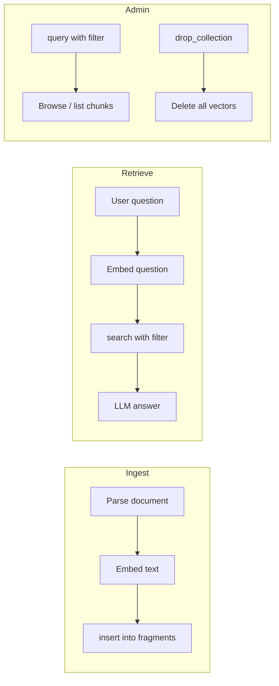
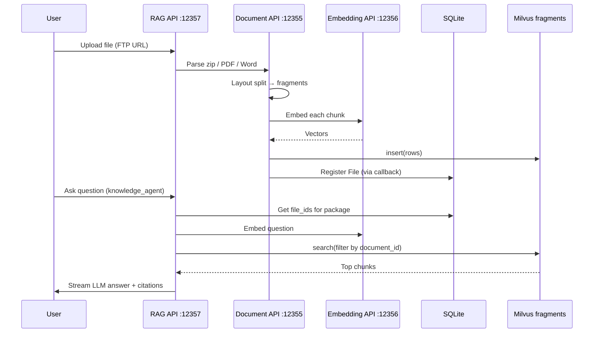

# 14 — Milvus Introduction (Beginner Guide)

A gentle introduction to **Milvus** — what it is, how it is organized, how this project uses it, and which tools you can use to work with it.

If you already know vector databases, skim §1–2 and jump to [§6 Quick start](#quick-start-verify--browse).

---

## What Milvus is

**Milvus** is an open-source **vector database**. It stores high-dimensional **embedding vectors** (lists of floats produced by a neural model) and finds rows whose vectors are **most similar** to a query vector — fast, even at millions of rows.

| Traditional DB (SQLite) | Vector DB (Milvus) |
|-------------------------|-------------------|
| Exact match: `WHERE id = 'abc'` | Similarity: “find chunks *like* this question” |
| Rows keyed by columns | Rows keyed by columns **plus** a vector field |
| Good for catalogs, users, chat logs | Good for semantic search, RAG retrieval |

### Why this project uses Milvus

The Document Fragment platform is a **RAG backend**:

1. Documents are parsed into text **fragments** (paragraphs, titles, tables).
2. Each fragment is embedded into a vector (Embedding API, `text2vec-base-multilingual`).
3. Vectors are stored in Milvus collection **`fragments`**.
4. When a user asks a question, the question is embedded and Milvus returns the **closest matching chunks** — those become LLM context.

Milvus answers: **“What text is semantically related to this question?”**

SQLite answers: **“Which knowledge base and files exist?”** — see [06-database.md](./06-database.md).

```
SQLite  →  catalog (Package, File, Agent, Dialogue)
Milvus  →  searchable document chunks (vectors + metadata)
Files   →  raw fragment JSON for citations
```

---

## Milvus structure (hierarchy)

Milvus organizes data in layers. Think of it like folders and spreadsheets with one special “similarity” column.

```
Database (optional namespace)
    └── Collection          ← like a SQL table, but with vectors
            └── Schema      ← field names + types
                    └── Entities (rows)
                            ├── scalar fields  (text, numbers, JSON-like blobs)
                            └── vector field   (embedding for similarity search)
```

### Terms mapped to this project

| Milvus concept | In this setup | Example |
|----------------|---------------|---------|
| **Database** | Default DB | Usually implicit; Attu may show `default` |
| **Collection** | **`fragments`** | Config: `COLLECTION_NAME` / `MILVUS_COLLECTION` |
| **Schema / fields** | Columns defined at create time | `id`, `document_id`, `page_content`, `vector`, … |
| **Entity (row)** | One **document fragment** | One paragraph or title block from one file |
| **Vector field** | `vector` | Embedding of `page_content` text |
| **Scalar fields** | Everything else | Metadata for filtering and citations |

### One row in `fragments` = one fragment

Each entity is **one layout-based chunk** from a parsed document (not a sliding window). See [11-knowledge-chunking.md](./11-knowledge-chunking.md).

| Field | Type (approx.) | Meaning in this project |
|-------|----------------|-------------------------|
| `id` | VARCHAR (primary key) | Unique chunk ID (`chunk-uuid`) |
| `vector` | FLOAT_VECTOR | Embedding of `page_content` |
| `page_content` | VARCHAR | Full text of the fragment |
| `document_id` | VARCHAR | File MD5 — links to SQLite `File.file_id` |
| `file_name` | VARCHAR | Original filename |
| `package_id` | VARCHAR | Often `"fragments"` at index time |
| `parent_id` | VARCHAR | Heading tree link for retrieval expansion |
| `outline` | INT | Heading level (0 = body, 1+ = titles) |
| `index` | INT | Order within the document |
| `type` | VARCHAR | e.g. `text`, `title`, `paragraph` |
| `pages` | JSON / array | Page numbers for citations |
| `coordinates` | JSON | Bounding boxes on PDF pages |
| `num_tokens` | INT | Stored as `0` (not computed at index time) |

**Mental model:**

```
File (SQLite: File.file_id = MD5)
    │
    ▼  Document API parses layout
Many rows in Milvus (one per fragment)
    each row: page_content + vector + document_id + coordinates + …
```

Collection **`fragments`** is created automatically on first upload if it does not exist (`src/api/services/utils.py` — dimension comes from the embedding model).

---

## Basic operations

Milvus exposes four operations you will see in this project and in Attu.

### Overview



| Operation | Needs a query vector? | What it does | Used for in this project |
|-----------|----------------------|--------------|--------------------------|
| **Insert** | No | Add new entities | Document API after parse + embed |
| **Search** | Yes | Rank by similarity + optional filter | RAG Q&A (`qa.py`) |
| **Query** | No | Return rows matching filter only | Duplicate check, list chunks, recommend |
| **Drop collection** | No | Delete entire collection | `DELETE /knowledge_manage/delete` |

### Insert

After parsing, the Document API builds rows and calls `milvus_client.insert("fragments", data)`.

```
PDF / Word / CAJ
    → fragments (layout parser)
    → convert_format() → chunks with metadata
    → Embedding API → vector per chunk
    → insert into Milvus
    → save fragment JSON to static/fragment/{md5}.json
```

Duplicate uploads are blocked with `query(filter="document_id == '{md5}'")` before insert.

### Search (vector similarity)

Used at Q&A time:

```
question text
    → embed (Embedding API)
    → search(fragments, data=[query_vector], filter="document_id in [...]", limit=30)
    → top similar chunks → LLM context
```

Search **always** needs a vector. The `filter` narrows which documents (or packages) are searched — syntax in [12-milvus-filter-expressions.md](./12-milvus-filter-expressions.md).

### Query (metadata only)

No embedding required — like `WHERE` without similarity ranking:

```python
milvus_client.query("fragments", filter="document_id == 'YOUR_MD5'", output_fields=["file_name", "page_content"])
```

Use cases: duplicate check, sampling chunks for recommendations, listing indexed files.

### Drop collection

Removes **all** vectors in `fragments` (destructive). Knowledge API exposes this for full re-index scenarios. SQLite metadata is separate — dropping Milvus does not remove `Package` / `File` rows.

---

## Tools for this setup

Four ways to interact with Milvus in this project — pick the one that fits your task.

```
┌──────────────────┬─────────────────────┬──────────────────────────────┐
│ Tool             │ Database            │ Best for                     │
├──────────────────┼─────────────────────┼──────────────────────────────┤
│ pymilvus         │ Milvus              │ What the app uses; scripts   │
│ Attu (browser)   │ Milvus              │ Browse, search, test filters │
│ Milvus REST API  │ Milvus              │ Automation without Python    │
│ Navicat / SQLite │ sqlite.db           │ Packages, files, agents, chat│
└──────────────────┴─────────────────────┴──────────────────────────────┘
```

### pymilvus (Python) — primary client in code

The project uses **`MilvusClient`** from `pymilvus` (v2.4.x, baked into the Docker image).

| Service | File | Typical calls |
|---------|------|---------------|
| Document API | `src/api/services/utils.py` | `create_collection`, `insert`, `query`, `refresh_load` |
| RAG / QA API | `src/rag/services/qa.py` | `search`, `query` |
| Knowledge API | `src/rag/services/knowledge.py` | `query`, `drop_collection` |

Connection string:

| From | URI |
|------|-----|
| App containers | `http://host.docker.internal:19530` |
| Host (PowerShell / local Python) | `http://localhost:19530` |

Config keys: `MILVUS_URI`, `MILVUS_COLLECTION` — [05-configuration.md](./05-configuration.md).

Minimal example (from host, Milvus running):

```python
from pymilvus import MilvusClient

client = MilvusClient("http://localhost:19530")
print(client.list_collections())  # expect ['fragments'] after indexing
```

More examples: [12-milvus-filter-expressions.md](./12-milvus-filter-expressions.md).  
Terminal / script alternatives (no browser): [15-milvus-cli-and-plain-usage.md](./15-milvus-cli-and-plain-usage.md).

### Attu — web GUI (already installed)

**Attu** is Milvus’s official browser UI. In this setup it runs as container `attu`:

| Item | Value |
|------|--------|
| URL | http://localhost:8000 |
| Milvus address | `host.docker.internal:19530` |
| Collection | `fragments` |

Use Attu when you want to **see rows**, **test filter expressions**, or **run vector search** without writing Python.

Full install, connect, and troubleshoot guide: [13-attu.md](./13-attu.md).

### Milvus REST API (mention)

Milvus standalone also exposes an **HTTP REST API** on the same port (`19530`) for health checks, collection management, and data operations. This project’s application code **does not** call REST directly — it uses `pymilvus`, which speaks gRPC under the hood.

REST is useful for curl-based health checks or third-party tools. Official docs: [Milvus RESTful API](https://milvus.io/docs/restful.md).

Example health check from the host:

```powershell
curl http://localhost:9091/healthz
```

(`9091` is the metrics/health port — see [06-database.md](./06-database.md).)

### Contrast with SQLite and “Navicat-style” tools

| | Milvus | SQLite (`sqlite.db`) |
|---|--------|----------------------|
| **Role here** | Semantic search over chunks | Knowledge bases, file registry, agents, chat |
| **Server** | Separate container `milvus-standalone` | Embedded file inside `qa_api` mount |
| **GUI** | **Attu** | Navicat, DBeaver, DB Browser for SQLite |
| **Query style** | Vector similarity + boolean filters | SQL (`SELECT … WHERE …`) |
| **Typical question** | “Which chunks match this question?” | “Which files are in package X?” |

**Important:** Deleting a file via the Knowledge API removes the SQLite row; **Milvus vectors may remain** until you drop the collection or re-index. Attu shows Milvus only — it will **not** show package names from SQLite.

---

## How Milvus fits in the pipeline

End-to-end flow for the Knowledge (知识库) feature:



Shorter ASCII view:

```
Upload (FTP) → Document API
                 ├─ parse → fragments
                 ├─ embed → vectors
                 ├─ INSERT → Milvus (fragments)
                 └─ callback → SQLite File row

Question → RAG API
              ├─ SQLite: which files in this package?
              ├─ embed question
              ├─ SEARCH Milvus (filtered by document_id)
              └─ LLM → answer with sources
```

Chunking details (layout vs sliding window): [11-knowledge-chunking.md](./11-knowledge-chunking.md).

---

## Quick start: verify & browse

Assume Docker images are loaded and app containers can run — see [02-startup.md](./02-startup.md) and [07-docker.md](./07-docker.md).

### 1. Start Milvus (if not running)

```powershell
docker start milvus-standalone
docker ps --filter name=milvus
```

Expected: container `milvus-standalone` on ports `19530` and `9091`.

First-time setup (manual container):

```powershell
docker run -d `
  --name milvus-standalone `
  --security-opt seccomp:unconfined `
  -p 19530:19530 -p 9091:9091 `
  -v "D:/setup/setup/volumes/milvus:/var/lib/milvus" `
  milvusdb/milvus:v2.4.4 `
  milvus run standalone
```

### 2. Health check

```powershell
curl http://localhost:9091/healthz
```

### 3. List collections (Python from app container)

```powershell
docker exec document_fragment-qa_api-1 python -c "
from pymilvus import MilvusClient
c = MilvusClient('http://host.docker.internal:19530')
print('Collections:', c.list_collections())
"
```

- Empty `[]` → Milvus is up but **no documents indexed yet**. Upload via Knowledge API to create `fragments`.
- `['fragments']` → ready for search and browse.

### 4. Peek at indexed data

```powershell
docker exec document_fragment-qa_api-1 python -c "
from pymilvus import MilvusClient
c = MilvusClient('http://host.docker.internal:19530')
rows = c.query('fragments', filter=\"document_id != ''\", limit=3,
               output_fields=['document_id','file_name','index'])
for r in rows:
    print(r)
"
```

### 5. Browse in Attu (GUI)

```powershell
docker start attu
```

Open http://localhost:8000 → connect to `host.docker.internal:19530` → open collection **`fragments`** → **Data** tab.

Step-by-step: [13-attu.md](./13-attu.md).

### 6. Typical startup order (full stack)

```powershell
docker start milvus-standalone
docker compose up -d
docker start attu
```

| Service | URL |
|---------|-----|
| Milvus | `localhost:19530` |
| Attu | http://localhost:8000 |
| Document API | http://localhost:12355/docs |
| Embedding API | http://localhost:12356/docs |
| RAG / QA API | http://localhost:12357/docs |

---

## What to read next

| Doc | Topic |
|-----|--------|
| [06-database.md](./06-database.md) | Milvus vs SQLite, ports, disk paths, backup |
| [12-milvus-filter-expressions.md](./12-milvus-filter-expressions.md) | Filter syntax, `query` vs `search`, code examples |
| [13-attu.md](./13-attu.md) | Attu install, connect, vector search, troubleshooting |
| [15-milvus-cli-and-plain-usage.md](./15-milvus-cli-and-plain-usage.md) | pymilvus one-liners, REST curl, milvus-cli — no SQL CLI |
| [11-knowledge-chunking.md](./11-knowledge-chunking.md) | What each Milvus row represents |
| [07-docker.md](./07-docker.md) | Containers, Milvus volume mount |

## External links

- [Milvus documentation](https://milvus.io/docs)
- [What is a vector database?](https://milvus.io/docs/overview.md)
- [pymilvus MilvusClient](https://milvus.io/api-reference/pymilvus/v2.4.x/MilvusClient/Client/MilvusClient.md)
